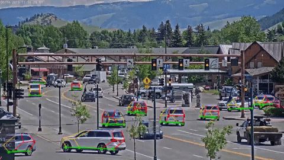

Occlusion-Net: 2D/3D Occluded Keypoint Localization Using Graph Networks 
======================

[N Dinesh Reddy](http://cs.cmu.edu/~dnarapur), [Minh Vo](http://cs.cmu.edu/~mvo), [Srinivasa G. Narasimhan](http://www.cs.cmu.edu/~srinivas/)

IEEE Conference on Computer Vision and Pattern Recognition (CVPR), 2019. 

[[Project](http://www.cs.cmu.edu/~ILIM/projects/IM/CarFusion/cvpr2019/index.html)] [[Paper](http://www.cs.cmu.edu/~ILIM/publications/PDFs/RVN-CVPR19.pdf)] [[Supp](http://www.cs.cmu.edu/~ILIM/projects/IM/CarFusion/pdf/occlusion_net_supp.pdf)] [[Bibtex](http://www.cs.cmu.edu/~ILIM/projects/IM/CarFusion/occlusion_net.bib) ]

### Live Demo of the algorithm on a youtube live stream can be found at:
<p align="center">
    [[](https://www.youtube.com/embed/v3dcMKbw_wI)]
</p>

### More Results
<p align="center">
    
    <br>
    <sup>Result of Occlusion-Net on a live video from youtube</sup>
</p>

## Installation

### Setting up with docker

All the stable releases of docker-ce installed from https://docs.docker.com/install/

Install the nvidia-docker from https://github.com/NVIDIA/nvidia-docker

Setting up the docker

```bash
nvidia-docker build -t occlusion_net .
```

### Setting up data
Follow the steps to download the carfusion dataset and setup at the 
```
git clone https://github.com/dineshreddy91/carfusion_to_coco
cd carfusion_to_coco
virtualenv carfusion2coco -p python3.6
source carfusion2coco/bin/activate
pip install cython numpy
pip install -r requirements.txt
sh carfusion_coco_setup.sh
deactivate
```

The final folder format to train on carfusion data needs to look :

 ```text
Occlusion-Net
    └─datasets
        └─carfusion
            └─train
                └─car_craig1
                    └───images
                        01_0000.jpg
                        01_0001.jpg
                        ...   
                    └───bb
                       01_0000.txt
                       01_0001.txt
                       ...
                    └───gt
                       01_0000.txt   
                       01_0001.txt
                       ...
            └─test
                └─car_penn1
                    └───images
                        01_0000.jpg
                        01_0001.jpg
                        ...   
                    └───bb
                       01_0000.txt
                       01_0001.txt
                       ...
                    └───gt
                       01_0000.txt   
                       01_0001.txt
                       ...
            └─annotations
                car_keypoints_train.json
                car_keypoints_test.json
                
```


### Running with docker

Training the model on the carfusion dataset 

```
sh train.sh occlusion_net <Path_to_Carfusion_dataset>
``` 


### Testing on a sample image
Download a pretrained model from  [[Google Drive](https://drive.google.com/open?id=1EUmhzeuMUnv5whv0ZmmOHTbtUiWdeDly)]

Results on a sample demo image

```
sh test.sh occlusion_net demo/demo.jpg
```


